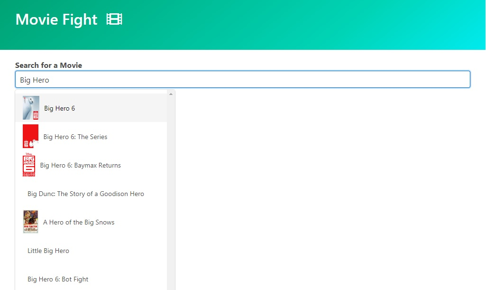
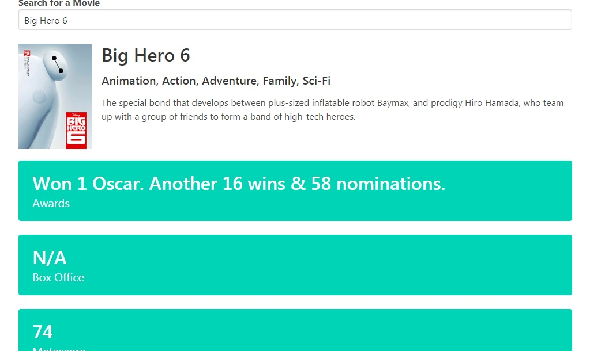

# Movie Battle App #
### Vanilla JavaScritp / HTML / CSS ###

*(Trabalho em andamento)*

[Clique aqui para ver a demonstração](https://moviebattleapp-michaelnsc.netlify.app/)

----

Aplicativo feito em javascript vanilla, com busca em tempo real na [API do OMDB API ](http://www.omdbapi.com/), usando AXIOS para as requisições HTTP.

 

----
#### Futuras implementações ####

- Melhorar o layout com Bulma CSS